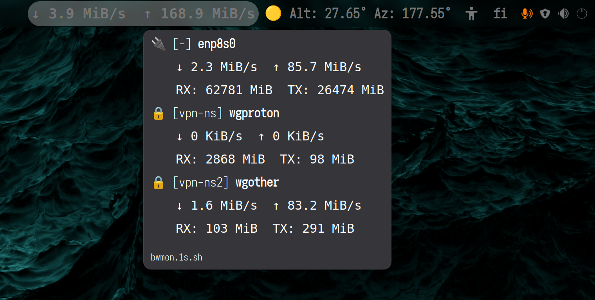

**GNOME Argos Namespace Bandwidth Monitor**

A highly optimized, lock-free bandwidth monitoring stack for Linux and GNOME Shell.
This project allows you to monitor network device speeds (RX/TX) across multiple network namespaces (such as WireGuard VPN tunnels) directly from your GNOME panel. It uses a decoupled architecture to ensure zero disk I/O, zero packet sniffing overhead, and strict execution security.

## Screenshot


## **Architecture Overview**

Monitoring interfaces inside network namespaces requires root privileges, but desktop UI widgets should never run as root. This stack solves the problem by splitting the workload:

1. **The Publisher (Root)**: A heavily sandboxed systemd service runs a pure Bash script in the background. It reads byte counts directly from the kernel (`/sys/class/net/`), transitions into configured network namespaces, and performs an atomic write to a shared memory file (tmpfs).
2. **The Frontend (User)**: A lightweight Bash script executed by the Argos GNOME extension reads the shared memory file, calculates the speed diffs, and formats the output for the top panel.

## **Files and Directories**

### **1\. Configuration File**

* **Path:** /etc/bwmon-devices
* **Permissions:** 644 (Owned by root)
* **Purpose:** Defines which network namespaces and devices the publisher daemon should monitor.

### **2\. Publisher Daemon**

* **Script:** /usr/local/bin/bwmon-publisher.sh
* **Service:** /etc/systemd/system/bwmon-publisher.service
* **Purpose:** The background loop. The systemd service is strictly hardened using Seccomp filters, restricted address families, and capability bounding (CAP\_SYS\_ADMIN only).

### **3\. IPC State Files (tmpfs)**

* **Shared Data:** /run/bwmon.state
  * Written by the root publisher, read by the desktop user. Contains the raw byte counts for the current second.
* **User Delta State:** /run/user/\<UID\>/bwmon/
  * Maintained entirely by the unprivileged Argos script. Stores the previous second's byte counts to calculate KB/s and MB/s.

### **4\. GNOME Argos Script**

* **Path:** ~/.config/argos/bwmon.1s.sh
* **Purpose:** The UI renderer. It reads `/run/bwmon.state`, formats the speeds with dynamic unit scaling (KiB/s, MiB/s, GiB/s), and outputs Pango-compatible text for GNOME Shell.

## **Configuration Guide**

The publisher daemon reads `/etc/bwmon-devices` to know what to monitor. You must create this file before starting the service.

### **Format**

The file expects one interface per line, formatted as:

```
[namespace] [device]
```

* **namespace:** The name of the network namespace. To specify the default (init) host namespace, use a hyphen (-).
* **device:** The name of the network interface (e.g., eth0, wg0, wlan0).

### **Example /etc/bwmon-devices**
```
- eth2
- wlp2s0
vpn1 wg0
vpn2 wg1
```

*In this example, eth2 and wlp2s0 are read from the host network, while wg0 and wg1 are read from their respective isolated namespaces.*

## **Installation and Setup**

1. **Create the configuration file:**
Populate `/etc/bwmon-devices` with your target interfaces.
```bash
vim /etc/bwmon-devices
```

2. **Install the Publisher Script:**
```bash
sudo install bwmon-publisher.sh /usr/local/bin/
```

3. **Install and Enable the Systemd Service:**
```bash
sudo install -m644 bwmon-publisher.service /etc/systemd/system/
sudo systemctl daemon-reload
sudo systemctl enable --now bwmon-publisher.service
```

4. **Install the Argos Frontend:**
   Place bwmon-combined.1s.sh into your Argos configuration directory and make it executable:
```bash
chmod +x ~/.config/argos/bwmon-combined.1s.sh
```

## **Security and Sandboxing Notes**

The bwmon-publisher.service is locked down using systemd's security features. If you experience crashes (Core Dumps) with a SIGSYS error, it means the script attempted a system call blocked by the Seccomp filter.
By design, the service is only allowed:

* `CAP_SYS_ADMIN` (Required for `setns()` to enter network namespaces).
* `@mount` system calls (Required by `ip netns exec` to set up the namespace environment).
* Read-only access to the host OS, with write access explicitly limited to `/run`.
